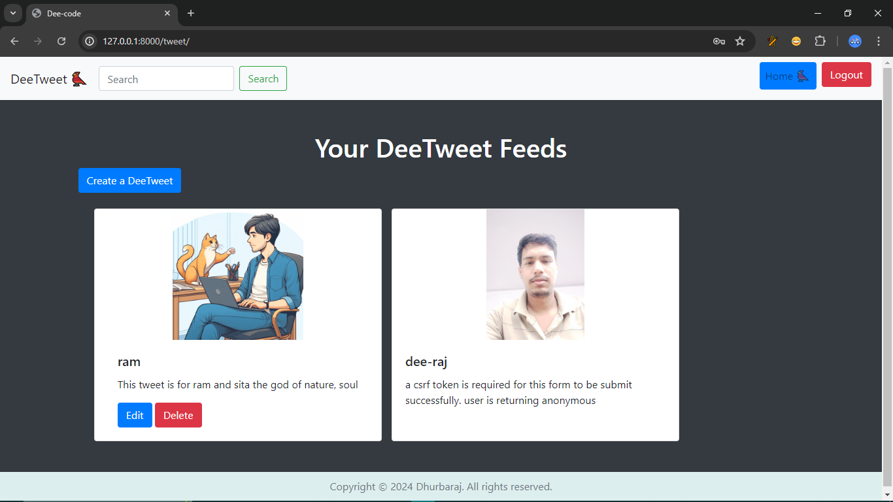
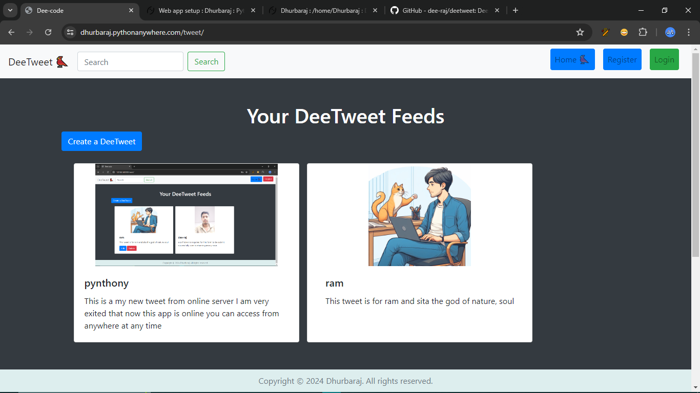

# 🐦 DeeTweet Django Project 🌐 

   Brief description or introduction of your project.

## Table of Contents
- [📝 Project Overview](#-project-overview)
- [🖥️ Demo](#-demo)
- [🚀 Installation](#-installation)
- [🔧 Usage](#-usage)
- [🤝 Contributing](#-contributing)
- [📄 License](#-license)

## 📝 Project Overview
DeeTweet is a Django-based web application that allows users to post short messages (tweets) which can be viewed and interacted with by other users. It provides a simple and intuitive interface for sharing thoughts and updates.


## 🖥️ Demo
   Explore a live demo of DeeTweet.

   - **Live Demo:** [DeeTweet Demo](https://dhurbaraj.pythonanywhere.com/tweet/)

### 🖼️ Front View




### 🖼️ Front View Online



## 🚀 Installation
   Get DeeTweet up and running on your local machine.

### Prerequisites
- Python 3.6+

- Django 3.0+

### Installation Steps:

   1. Clone the repository:
      ```
      git clone https://github.com/dee-raj//deetweet.git
      ```
   2. Navigate into the project directory:
      ```
      cd deetweet
      ```
   3. Create a virtual environment:
      ```
      python -m venv env
      ```
   4. Activate the virtual environment:
      - On Windows:
      ```
      .venv\Scripts\activate
      ```
      - On macOS/Linux:
      ```
      source env/bin/activate
      ```
   5. Install dependencies:
      ```
      pip install -r requirements.txt
      ```
   6. Apply migrations (if applicable):
      ```
      python manage.py migrate
      ```

   7. Create a superuser (admin account):
      ```
      python manage.py createsuperuser
      ```

---
## 🔧 Usage
   Start DeeTweet and begin posting tweets!

### Development Server:
   - Run the development server:
   ```
   python manage.py runserver
   ```
   - Access the application in a web browser at `http://localhost:8000/`.

## 🤝 Contributing
We welcome contributions to make DeeTweet better! To contribute:
   1. Fork the repository.
   2. Create your feature branch (`git checkout -b feature/YourFeature`).
   3. Commit your changes (`git commit -am 'Add some feature'`).
   4. Push to the branch (`git push origin feature/YourFeature`).
   5. Open a pull request.

## 📄 License
   - This project is licensed under the MIT License - see the [LICENSE](LICENSE) file for details.

